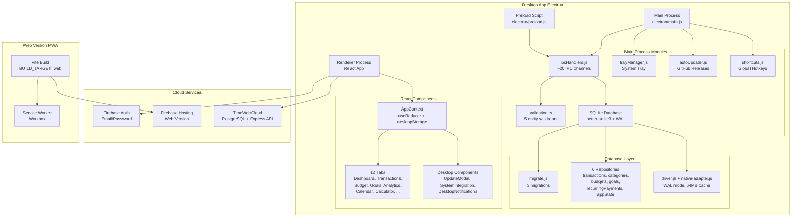
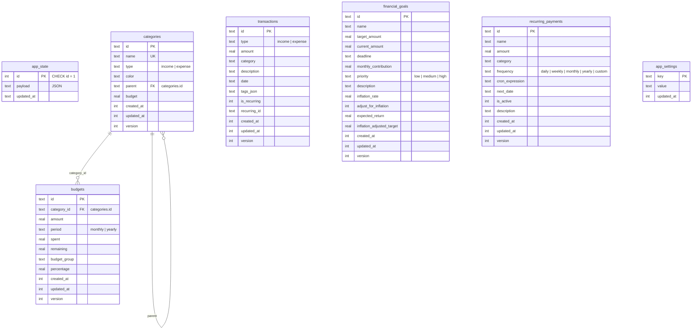

# Отчёт по проекту FinanceTracker (FLYN-new)

## 📋 Общая информация

| Параметр           | Значение                                                                 |
| ------------------ | ------------------------------------------------------------------------ |
| **Название**       | FinanceTracker Desktop                                                   |
| **Версия**         | 1.0.42                                                                   |
| **Описание**       | Современное десктопное приложение для управления личными финансами       |
| **Репозиторий**    | [github.com/APlightman/FLYN-new](https://github.com/APlightman/FLYN-new) |
| **Тип приложения** | Desktop-first/local-first: Electron + SQLite; cloud/server отложены     |
| **Язык**           | TypeScript / JavaScript (React + Electron)                               |
| **Статус**         | 🟢 Активная разработка                                                   |
| **Дата отчёта**    | 8 июля 2026                                                             |

---

## 🏗️ Архитектура проекта

Проект исторически развивался как **гибридное приложение** с тремя режимами работы, но текущий релизный фокус изменён на desktop-first/local-first:

1. **Десктопное приложение** (Electron + React + SQLite) — основной релизный режим.
2. **Веб-приложение** (PWA) — сохранено в кодовой базе, но не является текущим релизным приоритетом.
3. **Серверная часть** (Express + PostgreSQL/TimeWebCloud/Firebase Sync) — отложена для будущего этапа и не должна блокировать desktop-релиз.

### Стек технологий

| Компонент         | Технология                                              |
| ----------------- | ------------------------------------------------------- |
| **Фронтенд**      | React 18.3, TypeScript 5.5, Vite 5.4                    |
| **Стилизация**    | Tailwind CSS 3.4, PostCSS, autoprefixer                 |
| **UI-библиотека** | Radix UI (Dialog, Select, Label), Lucide React (иконки) |
| **Десктоп**       | Electron 28, electron-builder 24                        |
| **Локальная БД**  | better-sqlite3 11.7 (нативный Node.js модуль)           |
| **Облачная БД**   | PostgreSQL (TimeWebCloud) + Firebase Auth                |
| **Сервер**        | Express 5, pg (PostgreSQL driver)                       |
| **Тестирование**  | Vitest 3.2, jsdom 27, Testing Library 16                |
| **PWA**           | vite-plugin-pwa (Workbox)                               |
| **Сборщик**       | Vite 5, electron-builder, cross-env                      |

---

## 📁 Структура проекта

```
FLYN-new/
├── electron/                 # Electron main process
│   ├── main.js               # Точка входа Electron
│   ├── preload.js            # Безопасный bridge (contextBridge)
│   ├── assets/               # Иконки (ico, png, svg) + NSIS-скрипты
│   └── modules/
│       ├── autoUpdater.js    # Автообновления (electron-updater)
│       ├── electronRuntime.js # Абстракция Electron API
│       ├── ipcHandlers.js    # IPC-обработчики (~20 каналов)
│       ├── menuManager.js    # Меню приложения
│       ├── shortcuts.js      # Глобальные горячие клавиши
│       ├── trayManager.js    # Системный трей
│       ├── validation.js     # Валидация данных (5 сущностей)
│       ├── windowManager.js  # Управление окнами
│       └── db/               # База данных SQLite
│           ├── driver.js     # Драйвер better-sqlite3
│           ├── index.js      # Фасад БД (CRUD, миграции)
│           ├── migrate.js    # Система миграций
│           ├── native-adapter.js  # Адаптер better-sqlite3 (WAL)
│           ├── sqljs-adapter.js   # Legacy адаптер (не используется)
│           ├── migrations/   # SQL-миграции (001-003)
│           └── repositories/ # Репозитории (6 шт.)
├── installer/                # Установщик (Inno Setup)
├── plans/                    # Планы развития
├── scripts/                  # Скрипты сборки
├── server/                   # Серверная часть (Express + PostgreSQL)
├── src/                      # Исходный код React-приложения
│   ├── components/           # React-компоненты (12 вкладок + UI)
│   ├── contexts/             # React-контексты (AppContext, NotificationContext)
│   ├── hooks/                # Кастомные хуки (7 шт.)
│   ├── lib/                  # Утилиты (Firebase, desktopStorage, userCache)
│   ├── styles/               # Глобальные стили (5 файлов)
│   ├── types/                # TypeScript-типы
│   └── utils/                # Утилиты (import, export, date)
├── package.json              # Манифест проекта (v1.0.42)
├── vite.config.ts            # Конфигурация Vite
├── tailwind.config.js        # Конфигурация Tailwind
└── REPORT.md                 # Данный отчёт
```

---

## 🖥️ Electron — Main Process

### Точка входа ([`electron/main.js`](electron/main.js))

- **Single Instance Lock** — предотвращает запуск второго экземпляра приложения
- **Инициализация БД** — создание SQLite-файла и применение миграций при старте через `ensureDatabaseReady()`
- **Управление окном** — создание главного окна через `windowManager`
- **Системный трей** — иконка в трее с контекстным меню
- **Поведение при закрытии** — два режима: `exit` (полный выход) и `minimize-to-tray` (сворачивание в трей)
- **Content Security Policy** — настройка заголовков безопасности
- **Deep Links** — обработка протокола `financetracker://`
- **before-quit** — синхронное сохранение БД через `closeDatabaseConnectionSync()` перед выходом

### Preload Script ([`electron/preload.js`](electron/preload.js))

Безопасный bridge через `contextBridge.exposeInMainWorld`:

| API | Описание |
|-----|----------|
| `showSaveDialog` / `showOpenDialog` | Нативные диалоги файловой системы |
| `saveFile` / `readFile` | Файловые операции |
| `showNotification` / `updateTrayBadge` | Системные уведомления |
| `getSystemInfo` / `platform` / `versions` | Системная информация |
| `loadAppState` / `saveAppState` | UI-состояние |
| `bootstrapDomainData` / `listDomainData` | Доменные данные |
| CRUD-операции | `createEntity`, `updateEntity`, `deleteEntity` |
| `checkExternalDatabase` / `importFromExternalDatabase` | Импорт из внешней БД |
| `getCloseBehavior` / `setCloseBehavior` | Настройки закрытия |
| События | `onQuickAction`, `onNavigateTo`, `onUpdateAvailable`, `onDownloadProgress` |

### IPC-обработчики ([`electron/modules/ipcHandlers.js`](electron/modules/ipcHandlers.js))

~20 каналов IPC с валидацией через [`validation.js`](electron/modules/validation.js):

- **Файловые**: `show-save-dialog`, `show-open-dialog`, `save-file`, `read-file`
- **Уведомления**: `show-notification`, `update-tray-badge`
- **Система**: `get-system-info`, `restart-app`
- **Хранилище**: 8 каналов `storage:*` с валидацией типов, ID и структуры payload
- **Управление**: `get-close-behavior`, `set-close-behavior`

### Системный трей ([`electron/modules/trayManager.js`](electron/modules/trayManager.js))

- Контекстное меню: показать окно, быстрые действия, настройки, выход
- Горячая клавиша: `CmdOrCtrl+Shift+F` — показать окно
- Двойной клик — показать окно
- Динамический tooltip с количеством предупреждений

### Автообновления ([`electron/modules/autoUpdater.js`](electron/modules/autoUpdater.js))

- Проверка обновлений каждый час через `electron-updater`
- Источник: GitHub Releases
- События: `checking-for-update`, `update-available`, `update-not-available`, `download-progress`, `update-downloaded`
- Каналы событий в renderer: `onUpdateAvailable`, `onUpdateDownloaded`, `onDownloadProgress`

### Горячие клавиши ([`electron/modules/shortcuts.js`](electron/modules/shortcuts.js))

| Комбинация | Действие |
|------------|----------|
| `Ctrl+Shift+I` | Добавить доход |
| `Ctrl+Shift+E` | Добавить расход |
| `Ctrl+Shift+B` | Открыть бюджет |
| `Ctrl+H` | Свернуть окно |
| `Ctrl+Q` | Выход |

### Валидация данных ([`electron/modules/validation.js`](electron/modules/validation.js))

Полноценная система валидации для всех 5 сущностей:

- **Транзакции**: amount, type (income/expense), category, description, date, tags
- **Категории**: name, color, type (`income`/`expense`), parent, budget
- **Бюджеты**: categoryId, amount, spent, remaining, period (`monthly`/`yearly`), group, percentage
- **Цели**: name, targetAmount, currentAmount, deadline, monthlyContribution, priority, description, inflation-поля
- **Регулярные платежи**: name, amount, category, frequency (`daily`/`weekly`/`monthly`/`yearly`/`custom`), cronExpression, nextDate, isActive, description

Особенности:
- Санитизация строк (trim, обрезка длины)
- Валидация чисел с диапазонами
- Валидация дат
- Валидация тегов (макс. 20 тегов, макс. 50 символов каждый)
- Частичная валидация для обновлений (`validateUpdates`)
- Сохранение валидного `id` в sanitized payload для корректной записи через SQLite repositories

---

## 🗄️ База данных (SQLite)

### Движок: better-sqlite3 v11.7.0

**Нативный Node.js модуль** — данные пишутся на диск синхронно при каждой операции.

### Прагмы при подключении ([`native-adapter.js`](electron/modules/db/native-adapter.js))

```sql
journal_mode = WAL        -- Write-Ahead Log для надёжности
synchronous = NORMAL      -- баланс скорости и безопасности
foreign_keys = ON         -- внешние ключи
busy_timeout = 5000       -- таймаут блокировок (5 сек)
cache_size = -64000       -- 64MB кэша
```

### Система миграций ([`migrate.js`](electron/modules/db/migrate.js))

- Таблица `schema_migrations` для отслеживания применённых миграций
- Автоматическое применение новых `.sql`-файлов при запуске
- 3 миграции:

| Миграция | Файл | Содержание |
|----------|------|------------|
| 001 | [`001_initial_schema.sql`](electron/modules/db/migrations/001_initial_schema.sql) | `schema_migrations`, `app_state` |
| 002 | [`002_domain_entities.sql`](electron/modules/db/migrations/002_domain_entities.sql) | `categories`, `transactions` с индексами |
| 003 | [`003_remaining_entities.sql`](electron/modules/db/migrations/003_remaining_entities.sql) | `budgets`, `financial_goals`, `recurring_payments`, `app_settings` |

### Репозитории (6 шт.)

| Репозиторий | Сущность | Файл |
|-------------|----------|------|
| `appStateRepository` | UI-состояние | [`repositories/appStateRepository.js`](electron/modules/db/repositories/appStateRepository.js) |
| `transactionsRepository` | Транзакции | [`repositories/transactionsRepository.js`](electron/modules/db/repositories/transactionsRepository.js) |
| `categoriesRepository` | Категории | [`repositories/categoriesRepository.js`](electron/modules/db/repositories/categoriesRepository.js) |
| `budgetsRepository` | Бюджеты | [`repositories/budgetsRepository.js`](electron/modules/db/repositories/budgetsRepository.js) |
| `goalsRepository` | Финансовые цели | [`repositories/goalsRepository.js`](electron/modules/db/repositories/goalsRepository.js) |
| `recurringPaymentsRepository` | Регулярные платежи | [`repositories/recurringPaymentsRepository.js`](electron/modules/db/repositories/recurringPaymentsRepository.js) |

### Фасад БД ([`db/index.js`](electron/modules/db/index.js))

- `ensureDatabaseReady()` — открытие БД + миграции
- `loadPersistedAppState()` / `savePersistedAppState()` — UI-состояние
- `bootstrapDomainDataFromState()` — первичная загрузка данных из localStorage в SQLite
- `listDomainData()` — получение всех доменных данных
- CRUD: `createDomainEntity()`, `updateDomainEntity()`, `deleteDomainEntity()`
- `checkExternalDatabase()` — поиск SQLite-файлов в директории
- `importFromExternalDatabase()` — импорт из внешней БД с автоопределением схемы (транзакционная вставка с проверкой дубликатов)

---

## 🔑 Ключевые React-компоненты

### Управление состоянием ([`src/contexts/AppContext.tsx`](src/contexts/AppContext.tsx))

Центральный контекст через `useReducer`. Управляет всеми доменными сущностями с синхронизацией через `desktopStorage`.

**Архитектура:**
- Разделение UI состояния (filters, darkMode, selectedDate) и domain данных (transactions, categories, budgets, goals, recurringPayments)
- Hydration при загрузке: сначала загружается UI состояние из `app_state`, затем domain данные из отдельных таблиц
- Автосохранение при каждом изменении состояния через `useEffect`
- 20 предустановленных категорий (15 расходов, 5 доходов)
- Генерация ID через `crypto.randomUUID()` с fallback

### Десктопное хранилище ([`src/lib/desktopStorage.ts`](src/lib/desktopStorage.ts))

Абстракция над Electron IPC с автоматическим fallback на `localStorage`:

- `loadDesktopAppState()` — загрузка UI состояния (SQLite → localStorage → default)
- `saveDesktopAppState()` — сохранение UI состояния (только UI, без domain данных)
- `bootstrapDesktopDomainData()` — первичная запись domain данных в SQLite
- `loadDesktopDomainData()` — загрузка domain данных из SQLite
- CRUD: `createDesktopEntity()`, `updateDesktopEntity()`, `deleteDesktopEntity()`
- `checkExternalDatabase()` / `importFromExternalDatabase()` — импорт из внешней БД

### Electron-интеграция ([`src/hooks/useElectronIntegration.ts`](src/hooks/useElectronIntegration.ts))

Хук с полным API: диалоги, уведомления, трей, обновления, горячие клавиши.

### Аутентификация ([`src/hooks/useFirebaseAuth.ts`](src/hooks/useFirebaseAuth.ts))

Три режима: Email/Password, UID-логин (с кэшированием), гостевой режим.

### Синхронизация ([`src/hooks/useFirebaseSync.ts`](src/hooks/useFirebaseSync.ts))

Real-time синхронизация с Firebase Firestore через `onSnapshot` с валидацией.

### Маршрутизация ([`src/components/layout/AppContent.tsx`](src/components/layout/AppContent.tsx))

12 вкладок с адаптивным сайдбаром (3 режима: fixed, collapse-hover, collapse-click):

1. **Dashboard** — главная панель с прогрессом бюджета и целей
2. **Transactions** — список транзакций с фильтрацией
3. **Budget** — конвертная система бюджетирования (50/30/20)
4. **Goals** — финансовые цели с учётом инфляции
5. **Recurring** — регулярные платежи
6. **Analytics** — аналитика с графиками (BarChart, LineChart, PieChart)
7. **Calendar** — календарный вид транзакций
8. **Calculator** — финансовые калькуляторы (ипотека, депозиты, кредиты, автокредит)
9. **Categories** — управление категориями
10. **Import/Export** — импорт/экспорт данных (CSV, Excel, PDF)
11. **FAQ** — вопросы и ответы
12. **Settings** — настройки приложения

---

## 🗄️ Серверная часть

### Сервер ([`server/index.js`](server/index.js))

Express-сервер с REST API (порт 3001):

- **Middleware:** CORS, JSON, Firebase Auth (JWT) через `authMiddleware`
- **Эндпоинты:** полный CRUD для всех 5 сущностей
- **БД:** PostgreSQL через `pg.Pool`
- **Схема:** 5 таблиц с индексами и внешними ключами ([`server/migrations/init.sql`](server/migrations/init.sql))

### Эндпоинты API

| Метод | Путь | Описание |
|-------|------|----------|
| GET/POST | `/api/transactions` | Транзакции |
| GET/POST | `/api/categories` | Категории |
| GET/POST | `/api/budgets` | Бюджеты |
| GET/POST | `/api/goals` | Финансовые цели |
| GET/POST | `/api/recurring-payments` | Регулярные платежи |
| GET | `/api/health` | Health check |
| GET | `/api/db-test` | Проверка подключения к БД |

---

## 🔐 Firebase-интеграция

- **Firebase Auth** — аутентификация (email/password)
- **Firebase Hosting** — хостинг веб-версии
- **Firebase Analytics** — аналитика использования
- **Firebase Emulators** — для локальной разработки

Конфигурация из переменных окружения (`VITE_FIREBASE_*`). При отсутствии — полностью локальный режим.

---

## 📦 Сборка и установка

### Команды сборки

```bash
# Разработка
npm run dev              # Веб dev сервер (порт 5179)
npm run electron:dev     # Electron dev режим

# Сборка
npm run build:web        # Веб-сборка (PWA) в /build
npm run build:desktop    # Десктоп-сборка в /dist
npm run electron:pack    # Десктоп (без installer)
npm run electron:dist    # Десктоп с installer

# Platform-specific
npm run electron:dist:win    # Windows (NSIS, x64 + ia32)
npm run electron:dist:mac    # macOS (DMG, x64 + arm64)
npm run electron:dist:linux  # Linux (AppImage + deb, x64)

# Firebase
npm run firebase:deploy     # Деплой веб-версии
npm run firebase:emulators  # Локальные эмуляторы
```

### Конфигурация сборки ([`package.json`](package.json))

- **appId**: `com.financetracker.desktop`
- **productName**: `FinanceTracker`
- **asar**: true (с asarUnpack для `better_sqlite3.node`)
- **NSIS**: кастомный установщик с выбором директории, ярлыками, удалением старых версий
- **Publish**: GitHub Releases через `electron-updater`

### PWA-сборка ([`vite.config.ts`](vite.config.ts))

- Активируется через `BUILD_TARGET=web`
- Workbox service worker с autoUpdate
- PWA manifest с иконками 192x192 и 512x512
- Анализ размера бандла через `rollup-plugin-visualizer`

---

## 📊 Статус проекта

| Аспект                     | Статус               | Комментарий                                              |
| -------------------------- | -------------------- | -------------------------------------------------------- |
| **Фронтенд**               | ✅ Завершён          | Все 12 вкладок реализованы                               |
| **Electron main process**  | ✅ Завершён          | main.js, preload.js, IPC, трей, меню                     |
| **Локальная БД (SQLite)**  | ✅ Завершён          | better-sqlite3, WAL, миграции, репозитории               |
| **Импорт из внешней БД**   | ✅ Реализован        | Автоопределение схемы, транзакционная вставка            |
| **Автообновления**         | ✅ Реализован        | electron-updater с проверкой каждый час                  |
| **Firebase-синхронизация** | ✅ Реализована       | С валидацией и оффлайн-режимом                           |
| **Серверная часть**        | ✅ Реализована       | Express + PostgreSQL (TimeWebCloud)                      |
| **PWA**                    | ✅ Реализован        | Workbox service worker                                   |
| **Установщик**             | ✅ Реализован        | NSIS + Inno Setup                                        |
| **Валидация данных**       | ✅ Реализована       | 5 сущностей, санитизация, частичные обновления           |
| **CI/CD**                  | ❌ Не настроен       | Планируется GitHub Actions                               |
| **Цифровая подпись**       | ❌ Отсутствует       | Требуется для Windows                                    |
| **E2E тесты**              | ❌ Отсутствуют       | Требуются для Electron-приложения                        |
| **Unit-тесты**             | ❌ Отсутствуют       | Vitest настроен, тестов нет                              |

---

## 🎯 Основные функции

### 💰 Финансовый учет

- Учет доходов и расходов с категориями
- Конвертная система бюджетирования (50/30/20)
- Финансовые цели с учетом инфляции
- Регулярные автоматические платежи
- Аналитика и отчеты с графиками (BarChart, LineChart, PieChart)
- Календарный вид транзакций

### 🔧 Инструменты

- Финансовые калькуляторы (ипотека, депозиты, кредиты, автокредит)
- Импорт/экспорт данных (CSV, Excel, PDF)
- Темная/светлая тема
- Полная работа в офлайн режиме

### 🖥️ Десктопные возможности

- Системный трей с быстрыми действиями
- Глобальные горячие клавиши (навигация, быстрые действия)
- Умные уведомления о бюджете
- Автозапуск при старте системы
- Автоматические резервные копии
- Нативные диалоги сохранения файлов
- Автообновления приложения
- Импорт из внешних SQLite-БД

---

## 🗺️ Roadmap (пройденные этапы)

Проект прошёл 7 этапов развития согласно [`DESKTOP_ROADMAP.md`](DESKTOP_ROADMAP.md):

| Этап | Статус | Описание |
|------|--------|----------|
| 1. Стабилизация запуска | ✅ | Убран обязательный Firebase/login flow |
| 2. Локальный слой данных | ✅ | SQLite в Electron main process |
| 3. Переход данных на SQLite | ✅ | Все 5 сущностей + настройки |
| 4. IPC и preload API | ✅ | Безопасный bridge, SQL из renderer |
| 5. Продуктовая стабилизация | ✅ | Backup/restore, уведомления, горячие клавиши |
| 6. Сборка и установка на ПК | ✅ | electron-builder, NSIS установщик |
| 7. Переход на нативный SQLite | ✅ | better-sqlite3 вместо sql.js, WAL-режим |

---

## � Рекомендации

1. **Настроить GitHub Actions** — для автоматической сборки под все платформы
2. **Подписать установщик** — получить сертификат для Windows Authenticode
3. **Добавить E2E тесты** — Vitest настроен, но тестовые файлы отсутствуют
4. **Обновить зависимости** — Electron 28 → более новая версия (текущая 28.3.3)
5. **Добавить unit-тесты** — для критических модулей (БД, IPC-обработчики, валидация)
6. **Добавить миграцию 004** — для переноса данных из JSON payload в отдельные таблицы (упоминается в README, но файл отсутствует)
7. **Добавить индексы производительности** — миграция 005 с 12 составными индексами (упоминается в README, но файл отсутствует)

---

## 📐 Архитектурная диаграмма



---

## 💾 Схема данных SQLite



---

## Актуализация 2026-07-08: выполненные изменения

### Desktop-first/local-first направление

- Cloud/server/TimeWeb/Firebase Sync официально отложены и исключены из критического пути desktop-релиза.
- `electron:dev` больше не запускает server; старый cloud workflow сохранён отдельно как `electron:dev:cloud`.
- `src/lib/timeWebApi.ts` оставлен как compatibility layer, но реализация переведена на Electron/SQLite IPC (`listDomainData`, `createEntity`, `updateEntity`, `deleteEntity`).
- `server/.env.example` очищен от секретов и заменён безопасными placeholder-значениями.

### Исправления сборки и типов

- Восстановлены повреждённые `SidebarMenuItem.tsx` и `PrivacySettings.tsx`.
- Исправлен незавершённый `electron/modules/__tests__/setup.js`.
- Добавлены alias-настройки `src/*` в TypeScript/Vite.
- Расширены типы `window.electronAPI` для desktop storage/status/entity result contracts.
- Исправлены TypeScript-ошибки в формах, настройках, импорте/экспорте, уведомлениях, DatePicker, calculator icons и Firebase-auth compatibility.
- `useFormValidation` ослаблен до нормального `T extends object`, чтобы интерфейсы форм без индексной сигнатуры проходили типизацию.

### Валидация и тесты Electron

- `electron/modules/validation.js` приведён к фактической SQLite/domain модели:
  - категории больше не принимают `type = both`;
  - бюджеты используют `categoryId`/`amount`, а не старые `category`/`limit`;
  - цели используют `targetAmount`/`currentAmount`, а не старые `target`/`current`;
  - recurring payments больше не требуют `type`, поддерживают `custom` frequency с обязательным `cronExpression`.
- Тесты `tests/electron/validation_check.js` обновлены под новую модель и дополнены проверкой сохранения валидного `id`.

### Проверенный статус

| Команда | Результат |
|---------|-----------|
| `node node_modules/typescript/bin/tsc -b --noEmit` | ✅ PASS |
| `npm run lint` | ✅ PASS, 5 warning'ов Fast Refresh |
| `npx vitest run --config vitest.electron.config.ts` | ✅ PASS, 124 теста в 4 файлах |
| `npm run build:desktop` | ✅ PASS |
| `npx electron-builder --dir --config.win.signAndEditExecutable=false` | ✅ PASS |
| `npx electron-builder --dir` | ✅ PASS, стандартная x64 portable-сборка |
| `npx electron-builder --win` | ✅ PASS, NSIS-установщик `FinanceTracker Setup 1.0.42.exe` для x64 и ia32; SHA-256 `3bf05685c2d7bf235a8490680386df02c78a862509810708463b5c101e7b5d10` |

### Выполненные P0-действия после актуализации плана

- В `package.json` добавлен `author: "FinanceTracker Team"`; `appId`, `productName` и Windows icon подтверждены.
- `.env.example` и `server/.env.example` очищены от значений, похожих на реальные секреты; в них оставлены только placeholders.
- `dist-electron/win-unpacked/FinanceTracker.exe` успешно собран и присутствует.
- В сеансе с повышенными правами `winCodeSign` успешно распакован, а NSIS-установщик и `.blockmap` сформированы.
- В подключённый electron-builder NSIS include добавлен `customInstall`: после распаковки файлов он запускает `FinanceTracker.exe --init-db`; при неудаче приложение повторяет инициализацию при первом запуске.
- Silent NSIS-установка в изолированную папку завершилась с кодом 0; первый GUI-запуск установленного приложения успешно прошёл smoke-проверку.
- Изолированная SQLite БД применила 3 миграции; после принудительного завершения GUI подтверждены `PRAGMA integrity_check = ok`, WAL-режим и сохранность тестовой транзакции.
- Добавлены CSV round-trip и full-backup тесты: import принимает только CSV, а JSON backup включает `recurringPayments`.
- Финальный installer после этих изменений: SHA-256 `d9e0c265ec0cd1c9e1f4a669290ea70c177da09be43012c55cd0a0a25767798c`.
- По результатам ручной проверки исправлен экспорт: оба UI-пути используют один desktop-диалог, JSON снова доступен, TSV имеет корректное расширение, а PDF генерируется через Electron `webContents.printToPDF`, а не через нестабильное окно браузерной печати.
- Полный backup теперь намеренно доступен только как JSON: это исключает пустой/смешанный CSV и сохраняет транзакции, категории, бюджеты, цели и регулярные платежи без потери полей.
- CSV-импорт ограничен фактически поддерживаемым форматом и дополнен обработкой BOM, многострочных и экранированных полей; добавлены проверки обязательных заголовков категорий.
- Номер версии повышен до `1.0.42`: имя каждого экспорта теперь включает локальные дату, время и миллисекунды, а для `EBUSY`/`EPERM` показана инструкция закрыть файл или выбрать другое имя.

## План дальнейшей работы

### P0 — довести desktop-релиз до готовности

1. Перед публикацией подтвердить publisher/display name и юридические данные владельца продукта.
2. Повторить финальную сборку из чистого рабочего дерева, сверить checksum и приложить release notes.
3. Выполнить ручную установку под новым Windows-профилем и проверить полный CRUD всех сущностей через UI с перезапуском.
4. Пересобрать installer и прогнать UI-сценарии импорта CSV и экспорта в CSV/JSON/TSV/PDF, включая открытие PDF в Windows, ошибочные и частично валидные файлы. Импорт внешней SQLite БД отложен по текущему продуктовому приоритету.
5. Подготовить release notes для desktop-only версии.

### P1 — усилить качество и сопровождение

1. Добавить smoke/e2e тест запуска собранного Electron-приложения.
2. Расширить IPC CRUD-тесты для всех сущностей.
3. Документировать backup/restore и расположение SQLite БД для пользователя.
4. Решить вопрос с warning'ами `react-refresh/only-export-components`.
5. Проверить необходимость `@electron/rebuild`, так как electron-builder считает его избыточным.

### P2 — после desktop-релиза

1. Настроить CI/CD сборки Electron.
2. Настроить цифровую подпись Windows installer.
3. Подготовить автообновления через `electron-updater`/GitHub Releases.
4. Вернуться к cloud/server sync как отдельному направлению, не смешивая его с local-first ядром.

---

**FinanceTracker** — современное desktop-first приложение для управления личными финансами с локальным хранением данных в Electron + SQLite. Версия 1.0.42, текущий фокус — стабильный local-first desktop-релиз; cloud/server синхронизация отложена.
